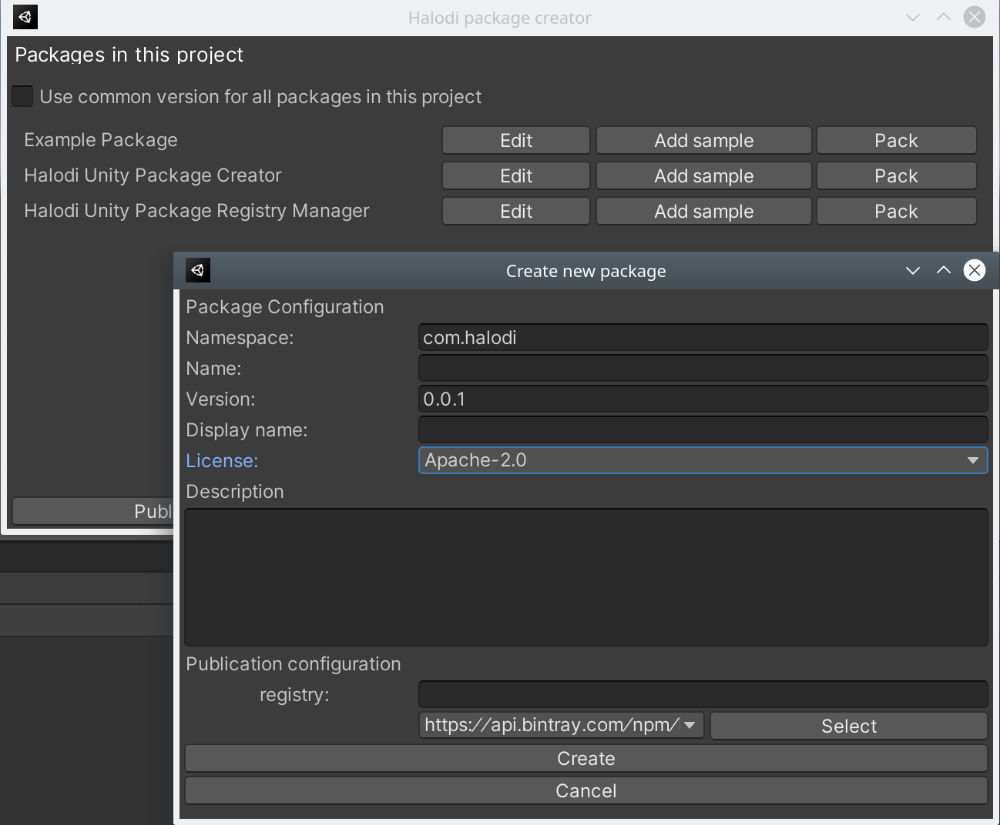

# Halodi Unity Package Creator

Tools for creating, editing and publishing Unity packages.




Functionality 

- Create packages inside the Packages/ folder, providing a basic file layout including asmdef files following the recommendation from Unity.
- Adding samples to the package in the Assets/[package-name] folder. These samples will be copied to the package on publishing.
- Publishing packages to a NPM registry (login credentials are set using "Halodi Unity Package Registry Manager")
- Create tarballs (pack) from a package.
- Automatically update package dependencies in the package.json when updating depenencies in the project.
- Enforce a common version for all packages in the Packages/ folder.

## License

Apache 2.0

## Installation

First, add "Halodi Unity Package Registry Manager" to your project. In Unity, go to Window -> Package manager, and "Add package from git URL" (Press + in the top left corner)

```
https://github.com/Halodi/halodi-unity-package-registry-manager.git
```

A new menu "Packages" will show up. Then add the "Halodi Unity Package Creator" to your project.


Go to "Packages -> Manage scoped registries" and add registry with the following settings

```
Name: Halodi OSS
Url: https://api.bintray.com/npm/halodirobotics/unity
Scope: com.halodi
Always auth: false
Token: [Leave empty]
```


Then go to Packages -> Add Packages (Bulk) and enter

```
com.halodi.halodi-unity-package-registry-manager
```

Press Add packages to add "Halodi Unity Package Creator" to your project.

## Usage

This package adds a new menu item under "Packages -> Manage packages in project" from where all functionality is available.


## Author

[Jesper](mailto:jesper@halodi.com)
